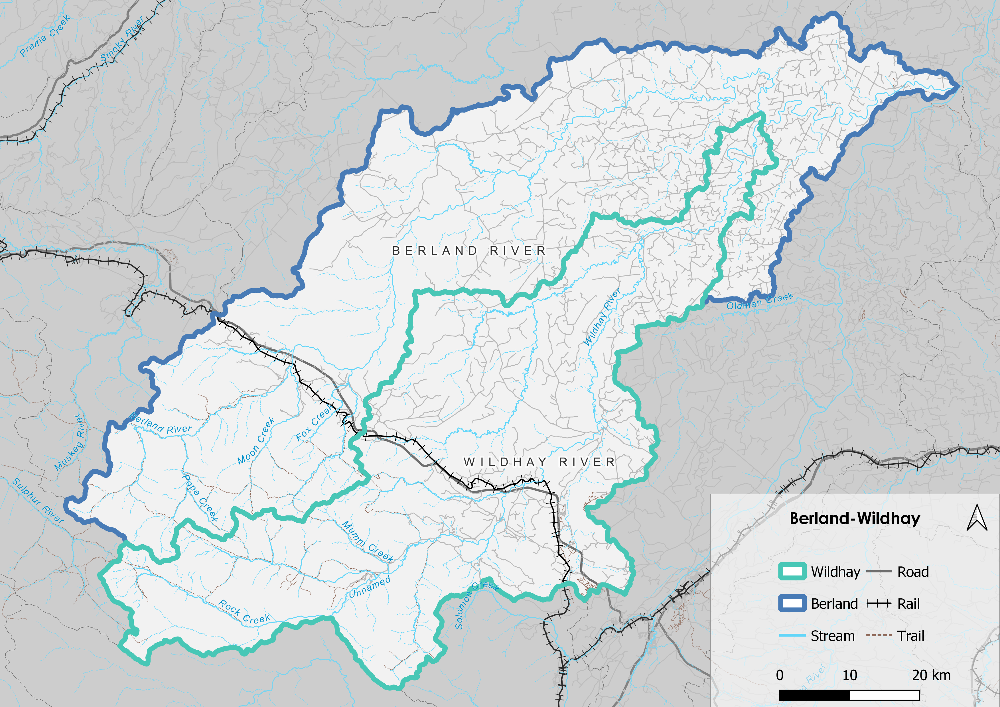

# Introduction {-} 

## Purpose {-}

This connectivity project was developed in partnership with the Canadian Wildlife Federation, Alberta Environment and Parks (AEP) and the Athabasca Watershed Council. The purpose of the Berland-Wildhay Watershed Connectivity Restoration Plan (WCRP) is to 
1) build collaborative partnerships within the Berland-Wildhay; 
2) improve understanding of habitat connectivity for Arctic Grayling (*Thymallus arcticus*), Bull Trout (*Salvelinus confluentus*), Mountain Whitefish (*Prosopium williamsoni*), and Athabasca Rainbow Trout (*Oncorhynchus mykiss*) in the Berland and Wildhay watersheds; and, 
3) inform efforts to close knowledge gaps and plan and prioritize field assessments and restoration.  

Local data and knowledge are combined with connectivity modelling to estimate current connectivity status and identify structures that potentially block the most habitat. This informs the prioritization of field assessments to close the most significant knowledge gaps efficiently. Information from field assessments of barrier status and habitat condition are incorporated into the model, improving understanding of which barriers block the most habitat. 

This information is also used to inform and plan restoration efforts. Structure rankings inform restoration prioritization by summarizing what is known about fragmentation and showing the relative amount of habitat upstream of each barrier. Actual prioritization of restoration activities is a social decision that requires additional information, including the quality and condition of upstream habitat, the cultural importance of different areas within the watershed, and the costs and logistics of addressing each barrier relative to the ecological benefits of doing so.  

As knowledge gaps are closed and barriers are addressed, this plan is revised to summarize progress and provide updated estimates of connectivity status and the status and relative importance of remaining structures. 

## Vision Statement {-}

Healthy, well-connected streams and rivers within the Berland-Wildhay Watershed support thriving populations of coldwater salmonids. Both residents and visitors to the watershed work together to reverse the negative effects of aquatic barriers, improving the resiliency of streams and rivers for the benefit and appreciation of all. 

## Scope {-}

This WCRP focuses on habitat connectivity for cold-water salmonids in the Berland and Wildhay watersheds (Figure X). Model outputs include an estimate of the current connectivity status along with structure ranks and counts.  

Connectivity models in this WCRP focus on longitudinal habitat fragmentation by anthropogenic structures, including all types of dams and stream crossings (i.e., road, rail, and trail). Beaver dams are considered a low risk to cold-water salmonids and are actively targeted for remediation only in certain circumstances. Diffuse natural barriers that make entire areas impassible are not included in the models but may be used to define the scope of this WCRP. For example, a tributary that is inhospitable because of increased water temperature may be excluded from the overall spatial scope of the WCRP because restoration needs there are broader than connectivity. 

