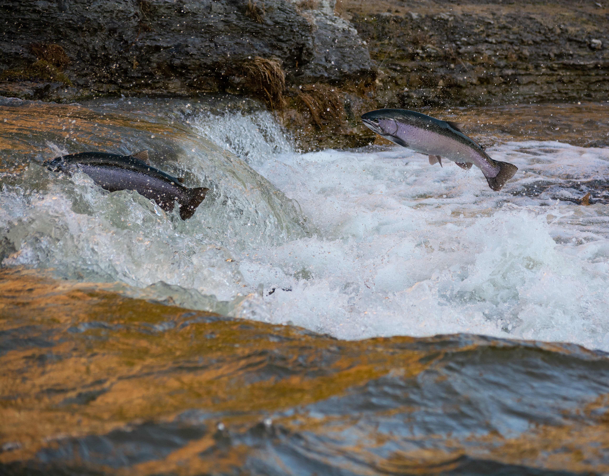

# Executive Summary {-}

The purpose of the Berland-Wildhay Watershed Connectivity Restoration Plan (WCRP) is to improve understanding of habitat connectivity Arctic Grayling (*Thymallus arcticus*), Bull Trout (*Salvelinus confluentus*), Mountain Whitefish (*Prosopium williamsoni*), and Athabasca Rainbow Trout (*Oncorhynchus mykiss*), herein referred to as cold-water salmonids in the Berland and Wildhay watersheds and inform efforts to close knowledge gaps and plan and prioritize restoration. Local data and knowledge are combined with connectivity modelling to estimate current connectivity status and identify structures that potentially block the most habitat. This informs the prioritization of field assessments to close the most significant knowledge gaps efficiently. Information from field assessments of barrier status and habitat condition are incorporated into the model, improving understanding of which barriers block the most habitat, and informing restoration prioritization. As knowledge gaps are closed and barriers are addressed, this plan will be revised to summarize progress and provide updated estimates of connectivity status and the status and relative importance of remaining structures. 

In the Berland and Wildhay watersheds, X km of cold-water salmonids habitat are currently connected to the ocean and X km are disconnected from it. This means that X% of the X km of total habitat is connected. 

In the Berland and Wildhay watersheds, X structures potentially disconnect cold-water salmonids habitat.  

![Figure 1: Map of cold-water salmonids habitat and structures that are confirmed or potential barriers to fish passage in the Berland and Wildhay watersheds as of July 2026. Structure data were obtained from ABFishPass and the Canadian Aquatic Barriers Database (aquaticbarriers.ca). The accessibility model represents areas of the watershed that one or more cold-water salmonid species could access naturally in the absence of anthropogenic barriers. The habitat model represents the subset of accessible waterbodies that may be used by one or more cold-water salmonids for spawning and/or rearing. Available local knowledge and data were incorporated and overruled habitat model results. Thick red lines represent habitat considered to be fully disconnected (upstream of barriers or unassessed structures).](content/images/HacMap.png)

This WCRP was initiated in 2022. Five planning meetings were held with the project management team from February 2022- May 2023, to discuss spatial and species scope. In 2025, Poseiden Environmental Ltd was contracted to complete 34 barrier assessments (Shewan, 2025a, 2025b). 